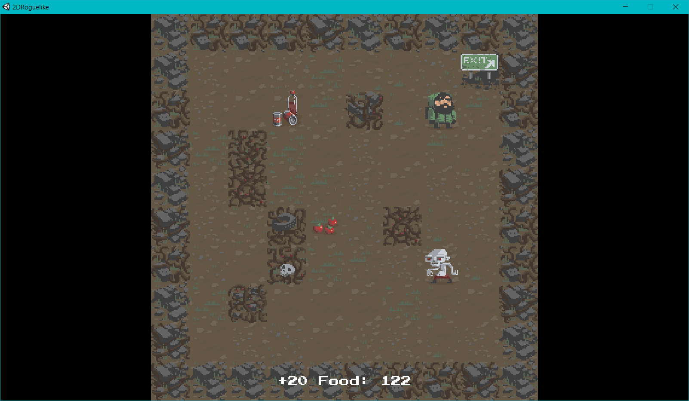

# L'octoRoguelike

## Présentation

Ceci est un **projet personnel** que j'ai codé sur mon temps libre en une dizaine d'heures.

Le principe était de découvrir **Unity** grâce à un [tutoriel](https://unity3d.com/fr/learn/tutorials/projects/2d-roguelike-tutorial) pour créer un roguelike en 2D.

Cela m'a permis de me familiariser avec les scripts en **C#**, le concept des **scènes**, ainsi que la génération procédurale de niveaux.

Petit aperçu :

